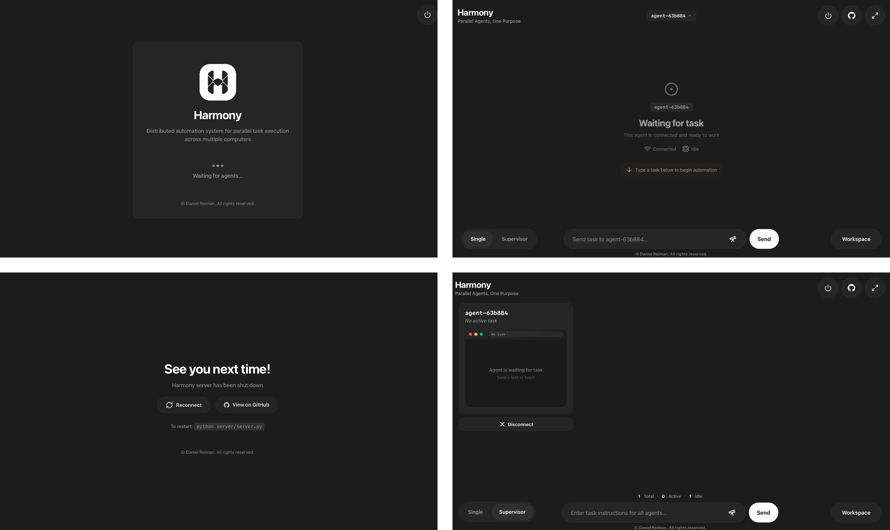

<p>
  
</p>

<h1>Harmony</h1>

<p>
  
</p>

<p>
  <strong>Distributed automation system for parallel task execution across multiple computers</strong>
</p>

> [!NOTE]
> To use the single agent version of Harmony without the orchestrator, parallel agents, or the central server, switch to the `single-agent` branch.

## Overview

Harmony is a client-server automation system that distributes tasks across multiple computers. A central server coordinates AI-powered agents, each controlling a connected client machine. Tasks are automatically assigned and executed in parallel across all available clients.

**Key Features:**
- Vision-based automation using AI models
- Automatic LAN discovery — clients find the server without manual configuration
- Parallel task execution across multiple machines
- Research mode with Google Docs integration
- Real-time agent monitoring via web dashboard
- Per-user task isolation with session-based authentication

## How It Looks

<p>
  
</p>

## Quick Start

### 1. Installation

```bash
# macOS/Linux
python -m venv .venv && source .venv/bin/activate && pip install -r requirements.txt

# Windows
python -m venv .venv; .\.venv\Scripts\Activate.ps1; pip install -r requirements.txt
```

### 2. Server Setup

Run the setup wizard to configure your API key and create the `.env` file:

```bash
python server/setup.py
```

Start the server:

```bash
python server/server.py
```

The server listens on port **1222** for agent connections, port **1223** for the dashboard API, and broadcasts on UDP port **3030** for auto-discovery.

### 3. Agent Client Setup

On each client machine you want to automate:

```bash
python agent-client/client.py
```

The client auto-discovers the server via UDP broadcast and connects automatically. No configuration needed.

### 4. Admin Dashboard (Optional)

The web dashboard lets you monitor agents, submit tasks, and view results. Start it on the server machine:

```bash
python admin-client/app.py
```

Access it at `http://localhost:1234`. To view it from another machine on the same LAN, use the server's IP (e.g., `http://SERVER_IP:1234`).

## Architecture

```
Server
├── server.py        # TCP listener on port 1222 — accepts agent connections
├── manager.py       # Assigns queued tasks to idle agents every second
├── agent.py         # One Agent instance per connected client
├── api.py           # Dashboard API on port 1223
└── database.py      # SQLite — users, sessions, tasks, agents, messages

Agent Client (on each remote machine)
├── client.py        # Connects to server, handles screenshot/action requests
└── helpers.py       # Discovery, PyAutoGUI actions, socket I/O

Admin Dashboard
├── app.py           # Flask app on port 1234
├── proxy.py         # Forwards requests to the server API
└── auth.py          # Session cookie validation
```

### Data Flow

1. Agent client starts and listens for a UDP beacon from the server
2. Server is found — client connects on TCP port 1222
3. Server creates an `Agent` instance and waits for a task
4. User submits a task via the dashboard
5. Manager assigns the task to an idle agent
6. Agent requests a screenshot from the client
7. AI model analyzes the screenshot and decides the next action
8. Agent sends the action to the client; client executes it with PyAutoGUI
9. Client reports success/failure back to the agent
10. Process repeats until the task is complete

### Threading Model

- **Server**: One thread per agent + manager thread + broadcast thread + API thread
- **Agent client**: Single-threaded with blocking socket communication
- **Agents**: Event-driven — each waits on a `threading.Event` until a task arrives

## Configuration

### Environment Variables

`server/setup.py` creates `server/.env` interactively. You can also create it manually:

```env
OLLAMA_API_KEY=your_api_key_here
```

### AI Model

Default model: `qwen3-vl:235b-instruct-cloud`

Configured in `server/server.py`:

```python
AI_MODEL = "qwen3-vl:235b-instruct-cloud"
```

### Google Docs Integration

For research mode, place a Google service account JSON file at:

```
server/service-account.json
```

The service account needs Editor access to any documents agents will write to.

## Project Structure

```
Harmony/
├── server/
│   ├── server.py        # TCP server entry point
│   ├── agent.py         # Agent class — think/act/look loop
│   ├── manager.py       # Task queue and distribution
│   ├── api.py           # Dashboard API server
│   ├── database.py      # SQLite access layer
│   ├── networking.py    # LAN broadcast and socket utilities
│   ├── google_docs.py   # Google Docs read/write
│   ├── prompts.py       # AI system prompts
│   ├── config.py        # Loads .env configuration
│   └── setup.py         # First-time setup wizard
├── agent-client/
│   ├── client.py        # Client main loop
│   └── helpers.py       # Discovery, actions, socket I/O
├── admin-client/
│   ├── app.py           # Flask dashboard routes
│   ├── proxy.py         # Proxies requests to the server API
│   ├── auth.py          # Session auth decorator
│   ├── config.py        # Dashboard configuration
│   ├── templates/       # HTML templates
│   └── static/          # CSS and JS
└── requirements.txt
```

## Agent Execution Loop

```
agent.activate()    # Wait for task assignment (blocks on threading.Event)
  → agent.run()     # Loop until task is complete or connection drops
    → agent.look()  # Request and receive screenshot from client
    → agent.think() # Send history to AI, get next action
    → agent.parse() # Extract step info, nudge if stuck in same phase
    → agent.done()  # Return True if AI chose "None" action
    → agent.act()   # Route to doc handler or send to client
    → agent.save()  # Persist state to .soul file and database
```

## Runtime Files

```
server/runtime/
├── screenshot_agent-{id}.png   # Latest screenshot per agent
└── agent-{id}.soul             # Agent state snapshot (JSON)
```
